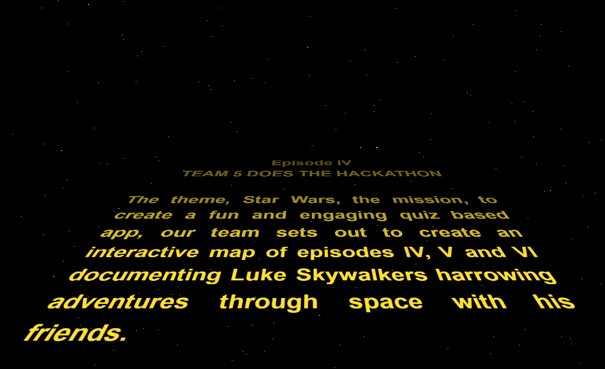

# Team Jedi Juggernauts

### Description

For [Code Institue](https://codeinstitute.net/) 's May Hackathon theme, Star Wars team Jedi Juggernauts has created a Star Wars quiz that takes you through a journey of planets visited by Luke Skywalker.

## Table of contents

- [Overview](#overview)
  - [About this project](#about-this-project)
  - [Screenshot](#screenshot)
  - [Link](#links)
  - [Technologies used](#technologies-used)
  - [What I learned](#what-i-learned)
  - [Useful resources](#useful-resources)
- [Authors](#authors)

### About this project

 
This is a fun interactive quiz where users get to experience the many planets of Luke Skywalker's journey through Star Wars Four, Five, and Six and test their knowledge of that historical journey.

### Characters

- Luke Skywalker
- Princess Leia 
- Han Solo 
- Chewbacca 
- C-3PO 
- R2-D2 
- Obi-Wan Kenobi 
- Yoda 
- Lando Calrissian
- Darth Vader 
- Ewok 

### Live Link

- Live Site URL: 

### Technologies Used

- HTML
- CSS
- Tailwind CSS
- JavaScript
- Python - Django

### Resources

- [Inkscape](https://inkscape.org/) to create the planets
- [Canva Magic Media](https://www.canva.com/apps/generate_image/magic-media) used to create characters.

## Authors

### Roles:

- Scrum Master - [Shaun Anderton](https://github.com/ShaAnder)

### Backend:

GitHub - [Teodora Brinzac](https://github.com/TeodoraAlina)

GitHub - [Joha Wilson](https://github.com/Joha-will)

GitHub - [Paul Hughes](https://github.com/hughes84)

### Frontend:

GitHub - [Beth Cottel](https://github.com/BeeBeeBethC)

LinkedIn - [Cecile Gaudron](https://www.linkedin.com/in/cecilegaudron/?locale=en_US)

GitHub - [SamAtkinsonModeste](https://www.github.com/SamAtkinsonModeste)
