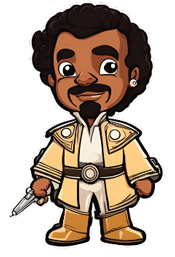

# Team Jedi Juggernauts

### Description

For [Code Institue](https://codeinstitute.net/) 's May Hackathon theme, Star Wars team Jedi Juggernauts has created a Star Wars quiz that takes you through a journey of planets visited by Luke Skywalker.

## Table of contents

- [Team Jedi Juggernauts](#team-jedi-juggernauts)
    - [Description](#description)
  - [Table of contents](#table-of-contents)
    - [About this project](#about-this-project)
    - [Characters](#characters)
    - [Live Link](#live-link)
    - [Technologies Used](#technologies-used)
    - [Resources](#resources)
  - [Authors](#authors)
    - [Roles:](#roles)
    - [Backend:](#backend)
    - [Frontend:](#frontend)

### About this project

 
This is a fun interactive quiz where users get to experience the many planets of Luke Skywalker's journey through Star Wars Four, Five, and Six and test their knowledge of that historical journey.

### Characters

- Luke Skywalker
- Princess Leia
- Han Solo
- Yoda
- Lando Calrissian
- Darth Vader
- Wicket W. Warrick

### Live Link

- Live Site URL: [StarQuiz](https://jedi-path-quizventure.onrender.com)

### Technologies Used

- HTML
- CSS
- Tailwind CSS
- JavaScript
- Python - Django

### Resources

- [Inkscape](https://inkscape.org/) to create the planets
- [Canva Magic Media](https://www.canva.com/apps/generate_image/magic-media) used to create characters.

## Authors

### Roles:

- Scrum Master - [Shaun Anderton](https://github.com/ShaAnder)

### Backend:

GitHub - [Teodora Brinzac](https://github.com/TeodoraAlina)

GitHub - [Joha Wilson](https://github.com/Joha-will)

GitHub - [Paul Hughes](https://github.com/hughes84)

### Frontend:

GitHub - [Beth Cottel](https://github.com/BeeBeeBethC)

LinkedIn - [Cecile Gaudron](https://www.linkedin.com/in/cecilegaudron/?locale=en_US)

GitHub - [Sam Atkinson Modeste](https://www.github.com/SamAtkinsonModeste)
